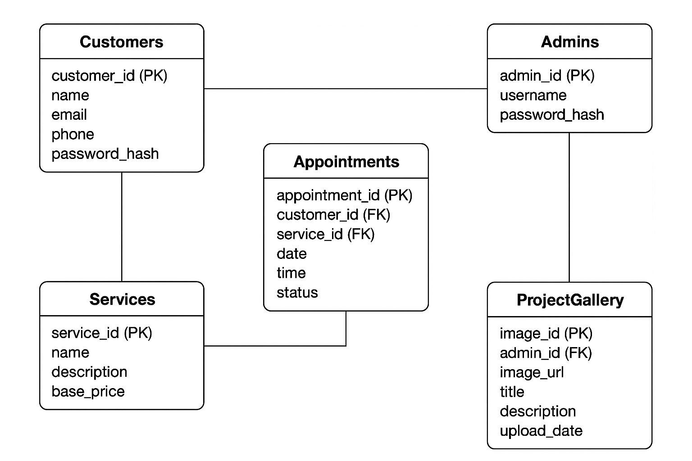

<h1 align="center">JM-Comfort</h1>

  

  This also serves as our software logo.

## Table of Contents
- [Collaborators](#collaborators)
- [Synopsis](#synopsis)
- [Visuals](#visuals)
- [Project Timeline](#project-timeline)
- [Testing](#testing)
- [Development](#development)
- [Developer Instructions](#developer-instructions)
- [Academic Information](#-academic-information)

## 📝 Synopsis 

JM Comfort is a full-stack HVAC service management platform designed to streamline the experience for both customers and mechanics. Our system focuses on allowing customers to schedule appointments, view services, read promotions, and interact with mechanics, while giving the business side tools for performance analytics, salary calculations, and status tracking.

**Core goals:**

- Build a clean, modern, mobile-friendly interface for customers

- Provide an intuitive dashboard for mechanics and staff

- Implement an appointment scheduling system with confirmations & notifications

- Track services, promotions, reviews, and status updates

- Support analytics features such as performance metrics and salary calculations

**Why:** Our aim is to digitize and modernize the JM Comfort service experience by creating a seamless and user-friendly platform that benefits both customers and employees.

## 🧪 Testing

  
<strong>To be completed in CSC 191</strong>

   

  **Some expected deliverables to include:**
  - Unit tests for backend services
  - Integration tests for API routes
  - Automated frontend tests for components
  - Manual workflow testing (with logs + screenshots)

## 🚀 Deployment

  
<strong>To be completed in CSC 191</strong>

   

  **Deployment targets may include:**
  - Frontend: React / Tailwind / Vite
  - Backend: Node.js
  - Database: AWS RDS (MySQL)
  - Environment: CI/CD via GitHub Actions

## 📃 Developer Instructions

  
<strong>To be completed in CSC 191</strong>

   

  **This section will include:**
  - How to run the frontend & backend locally
  - API route documentation
  - Database setup instructions
  - Environment variable configuration
  - How to add new features or components

## 🖼️ Visuals 

### Screen Shots and Demos
It's our goal to have more finalized versions of evreything by the end of the first sprint in CSC 191 

### Home page 

### Reviews Page 
 

### ERD diagram 

Very basic Erd diagram, we need to establish more relations with the admins, since that's the only login account for our entire project. 
 

## Project Timeline

📅 **CSC 191 Timeline** 

This timeline outlines our expected development milestones for JM-Comfort during CSC 191, based on the user stories and estimates from our current JIRA backlog.

  | Sprint   | Key Feature(s)               | Date | Status        |
  |----------|-----------------|------------------------------|--------------------|
  | Spirnt 0 |  Foundation/Setup | 8/25-9/21  | Complete ✅ |
  | Sprint 1 |  Research |       9/22-10/05   | Complete✅  |
  | Sprint 2 |     Setting up DB, server, and creating the pages |  10/06-10/19    |  Complete✅  |
  | Sprint 3 |       Add companies introduction and main page  |      10/20-11/02   |      Complete✅  |
  | Sprint 4 |    Implement Services, Reviews, adn Login Admin page for gallery images   |          11/03-11/16    |    Review ⏰       |
  | Sprint 5 | Service Request, Admin Page Gallery Setup completion, & Scheduling System | TBD         | ⏳ Upcoming  |
  | Sprint 6 | Full Completion of Admin page, that allows user full permissions; allow us to manage appointments, reviews, services, and projects without code. | TBD | ⏳ Upcoming                     |
  | Sprint 7 | Make sure website is near full completion, with hashing of password, correct email sends, deletion of user data, and near completion of backened   | TBD    | ⏳ Upcoming       |
  | Sprint 8 | finalize testing, optimize performance, and prepare for the process of deployment      | TBD      | ⏳ Upcoming       |
  | Sprint 9 | Testing and Deployment is a go| TBD | ⏳ Upcoming  |

## 🏫 Academic Information 
**Sacramento State - CSC 190/191 Senior Project**  

**Course:** Senior Project Parts 1 and 2

**Semester:** Fall 2025 - Spring 2026  

**Instructor:** Kenneth Elliot  

**190 Lab Advisor:** Peng Kang  

**191 Lab Advisor:** TBD  

## 🤝 Collaborators:
- Ibrahim Aljanabi
- Cole Hollandsworth
- Kevin Maldonado
- Moneeb Najibi
- Fares Shobaki
- Jan Nassri
- Faizan Tariq
- Ammar Taeha

