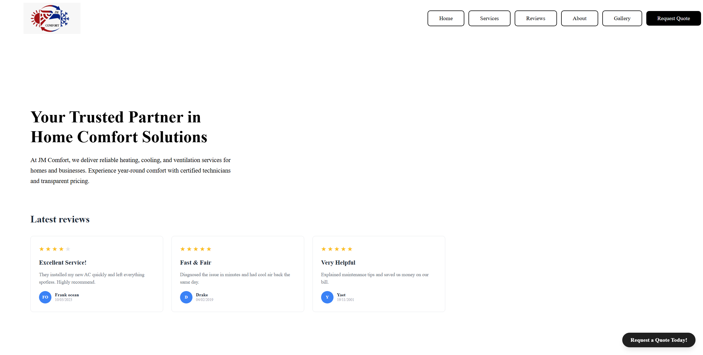
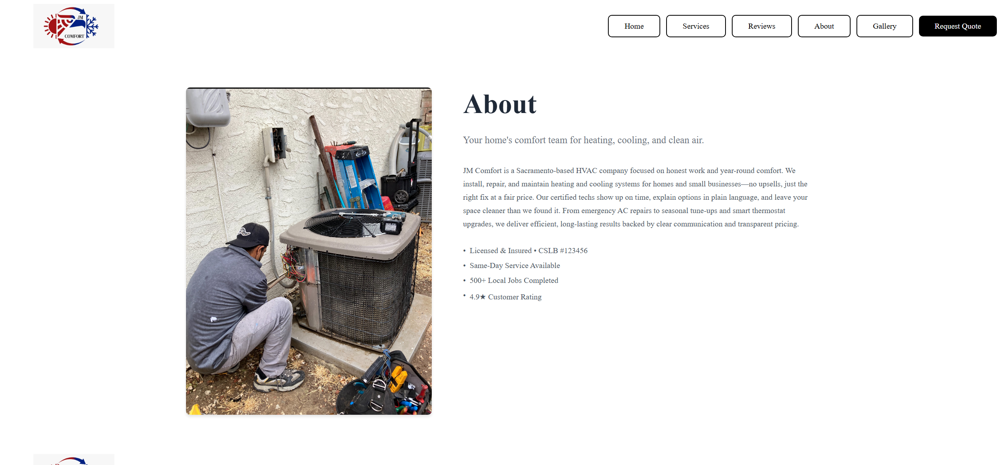
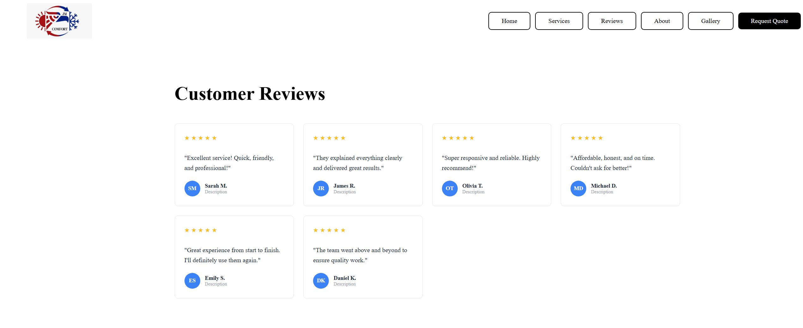
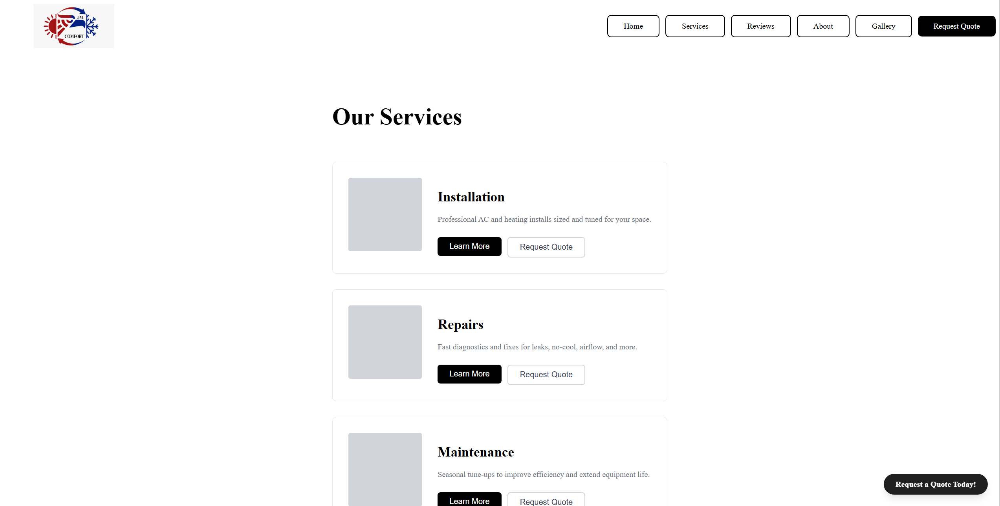
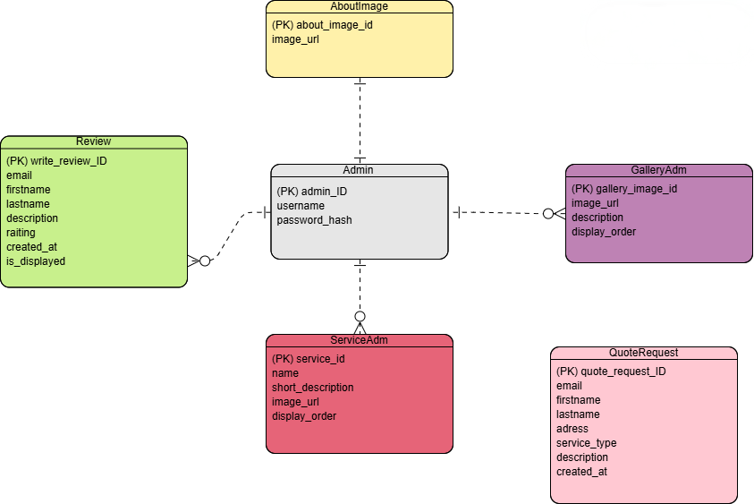

<h1 align="center">JM-Comfort</h1>

  

  This also serves as our projects logo.

## Table of Contents
- [Collaborators](#-collaborators)
- [Synopsis](#-synopsis)
- [Visuals](#-visuals)
- [Project Timeline](#-project-timeline)
- [Testing](#-testing)
- [Development](#-development)
- [Developer Instructions](#-developer-instructions)
- [Academic Information](#-academic-information)
- [Project Product Owner](#-project-product-owner)

## 📝 Synopsis 

JM Comfort is a full-stack HVAC service management platform designed to streamline the experience for both customers and mechanics. Our system focuses on allowing customers to schedule appointments, view services, read promotions, and interact with mechanics, while giving the business side tools for performance analytics, salary calculations, and status tracking.

**Core goals:**

- Build a clean, modern, mobile-friendly interface for customers

- Provide an intuitive dashboard for mechanics and staff

- Implement an appointment scheduling system with confirmations & notifications

- Track services, promotions, reviews, and status updates

- Support analytics features such as performance metrics and salary calculations

**Why:** Our aim is to digitize and modernize the JM Comfort service experience by creating a seamless and user-friendly platform that benefits both customers and employees.

## 🧪 Testing

  
<strong>To be completed in CSC 191</strong>

   

  **Expected deliverables may include:**
  - Unit tests for backend services
  - Integration tests for API routes
  - Automated frontend tests for components
  - Manual workflow testing (with logs + screenshots)

## 🚀 Deployment

  
<strong>To be completed in CSC 191</strong>

   

  **Deployment targets may include:**
  - Frontend: React / Tailwind / Vite
  - Backend: Node.js
  - Database: AWS RDS (MySQL)
  - Environment: CI/CD via GitHub Actions

## 📃 Developer Instructions

  
<strong>To be completed in CSC 191</strong>

   

  **This section will include:**
  - How to run the frontend & backend locally
  - API route documentation
  - Database setup instructions
  - Environment variable configuration
  - How to add new features or components

## 🖼️ Visuals 

### Screen Shots and Demos
Our goal is to have more finalized versions of most of the website pages by the end of the first sprint in CSC 191.

### Home page 

### About page 

### Reviews page 
 

### Services page 

### Login page

### Successful login
 

### ERD diagram 

To summarize the ERD briefly: the only login required is for the admin, who is responsible for updating pictures and certain descriptions. 

## 📅 Project Timeline

**CSC 190/191 Timeline** 

This timeline outlines our current status of development for CSC 190 and future development milestones for CSC 191, basing it off our current user stories and estimates from the JIRA backlog.

  | Sprint   | Key Feature(s)               | Date | Status        |
  |----------|-----------------|------------------------------|--------------------|
  | Spirnt 0 |  Foundation/setup of group | 8/25-9/21  | Complete ✅ |
  | Sprint 1 |  Research |       9/22-10/05   | Complete✅  |
  | Sprint 2 |     Setting up the DB, server, and creating pages |  10/06-10/19    |  Complete✅  |
  | Sprint 3 |       Add companies about and main page  |      10/20-11/02   |      Complete✅  |
  | Sprint 4 |    Implement services and reviews pages as well as the admin page for login and image updates  |          11/03-11/16    |    Image updates still in progress ⏰       |
  | Sprint 5 | Service request, admin page gallery setup completion, & scheduling system | TBD         | ⏳ Upcoming  |
  | Sprint 6 | Full completion of admin page, that allows user full permissions, which allow the user to manage appointments, reviews, services, and projects without code. | TBD | ⏳ Upcoming                     |
  | Sprint 7 | Ensure the website is near full completion, including password hashing, correct email sending and receiving, deletion of user data upon request, and major backend completion.   | TBD    | ⏳ Upcoming       |
  | Sprint 8 | Finalize testing, optimize performance, and prepare for the process of deployment      | TBD      | ⏳ Upcoming       |
  | Sprint 9 | Testing and deployment | TBD | ⏳ Upcoming  |

## 🏫 Academic Information 
**Sacramento State - CSC 190/191 Senior Project**  

**Course:** Senior Project Parts 1 and 2

**Semester:** Fall 2025 - Spring 2026  

**Instructor:** Kenneth Elliot  

**190 Lab Advisor:** Peng Kang  

**191 Lab Advisor:** TBD  

## 🤝 Collaborators:
- Ibrahim Aljanabi
- Cole Hollandsworth
- Kevin Maldonado
- Moneeb Najibi
- Fares Shobaki
- Jan Nassri
- Faizan Tariq
- Ammar Taeha

## 🤵 Project Product Owner
**Name:** Jose Maldanado     
**Title:** Owner   
**Organization:** JM Comfort     
**Email:** Jc11maldonado@gmail.com  

