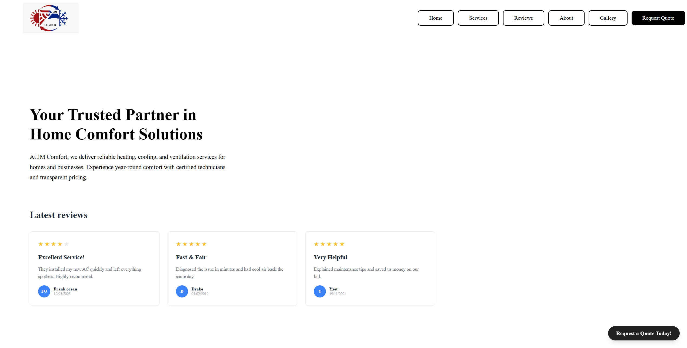
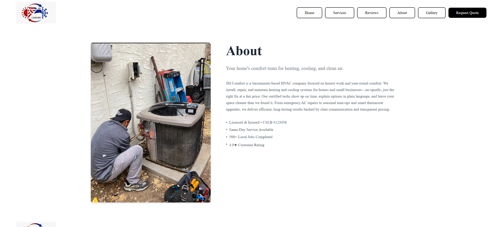
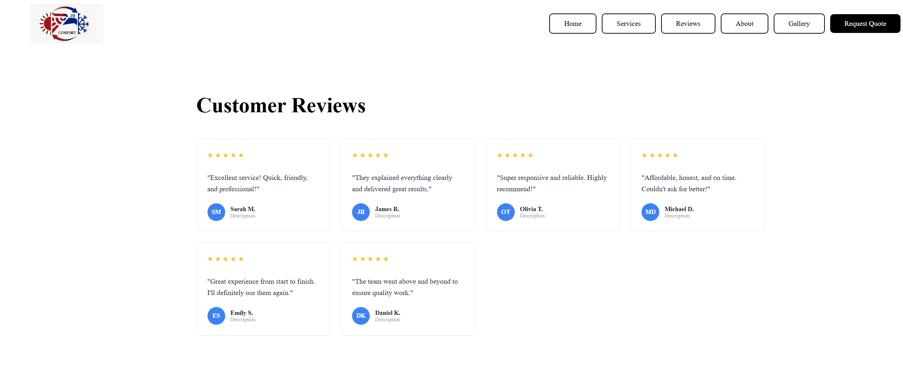
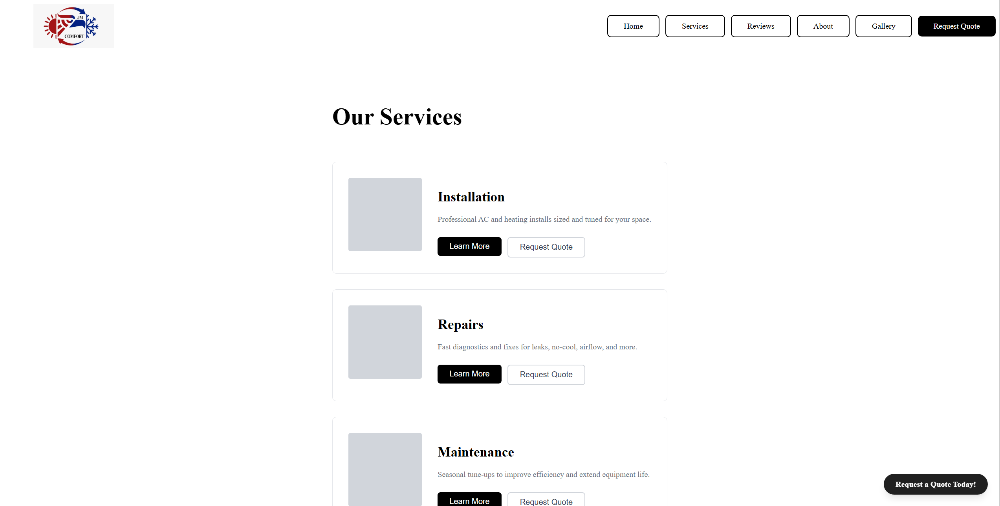
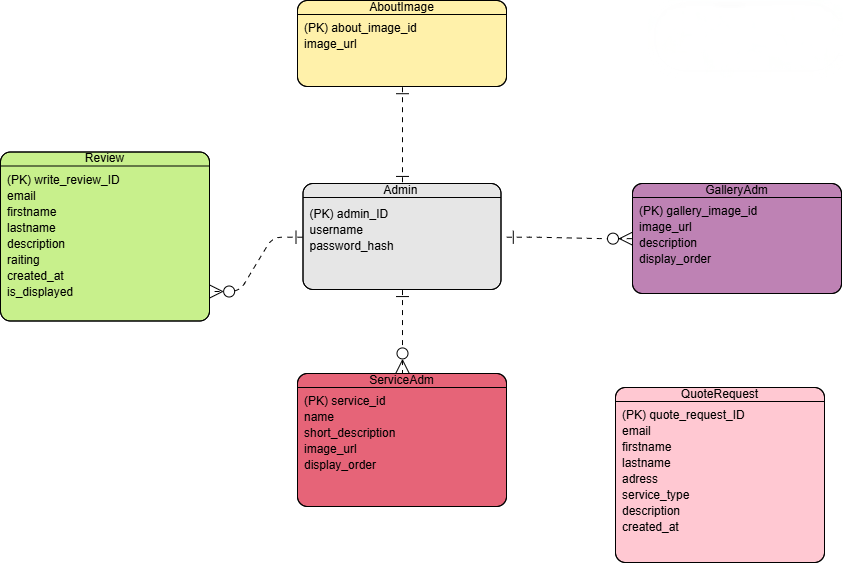

<h1 align="center">JM-Comfort</h1>

<p align="center">
  
</p>

<p align="center">
  This also serves as our projects logo.
</p>

## Table of Contents
- [Collaborators](#-collaborators)
- [Synopsis](#-synopsis)
- [Tech Stack](#-tech-stack)
- [Visuals](#-visuals)
- [Project Timeline](#-project-timeline)
- [Testing](#-testing)
- [Deployment](#-deployment)
- [Developer Instructions](#-developer-instructions)
- [Academic Information](#-academic-information)
- [Project Product Owner](#-project-product-owner)


## 📝 Synopsis 

JM Comfort is a full-stack HVAC service management platform designed to streamline the experience for both customers and mechanics. Our system focuses on allowing customers to schedule appointments, view services, read promotions, and interact with mechanics, while giving the business side tools for performance analytics, salary calculations, and status tracking.

**Core goals:**

- Build a clean, modern, mobile-friendly interface for customers

- Provide an intuitive dashboard for mechanics and staff

- Implement an appointment scheduling system with confirmations & notifications

- Track services, promotions, reviews, and status updates

- Support analytics features such as performance metrics and salary calculations

**Why:** Our aim is to digitize and modernize the JM Comfort service experience by creating a seamless and user-friendly platform that benefits both customers and employees.


## 🛠️ Tech Stack

| Layer | Technology |
|-------|------------|
| Frontend | React 19, React Router 7, Tailwind CSS 4, Vite 7 |
| Backend | Node.js 22, Express 5 |
| Database | MySQL 8 (AWS RDS in production) |
| File Storage | AWS S3 (gallery image uploads) |
| Email | Nodemailer (SMTP) |
| Error Tracking | Sentry (frontend + backend) |
| Analytics | Google Analytics 4 (react-ga4) |


## 🧪 Testing

The server has two test suites that run independently.

**Jest tests** (`server/__tests__/`) — unit tests with mocked DB/services:

```bash
cd server
npx jest
```

**Node built-in test runner** (`server/tests/`) — integration-style tests:

```bash
cd server
node --test tests/
```

Test coverage areas:
- Appointment creation, validation, and status transitions
- Gallery upload (file type/size validation, S3 metadata, error handling)
- Database schema assertions
- Email confirmation logic


## 🚀 Deployment

### Services Required

| Service | Purpose |
|---------|---------|
| MySQL 8 database | Persistent data storage |
| AWS S3 bucket | Gallery image storage |
| SMTP server | Appointment confirmation emails |
| Node.js 22 host | Backend server |
| Static host (optional) | Frontend build (or serve via Express) |

### Production Environment Variables

Copy `.env.example` to `.env` in the **project root** and fill in all values:

```bash
cp .env.example .env
```

| Variable | Description |
|----------|-------------|
| `DB_HOST` | MySQL host (e.g., your RDS endpoint) |
| `DB_PORT` | MySQL port (default: `3306`) |
| `DB_NAME` | Database name (`jm_comfort`) |
| `DB_USER` | Database user |
| `DB_PASS` | Database password |
| `PORT` | Server port (set to `5000` — required by Vite proxy) |
| `NODE_ENV` | Set to `production` |
| `SMTP_HOST` | SMTP server hostname |
| `SMTP_PORT` | SMTP port (`587` for TLS, `465` for SSL) |
| `SMTP_USER` | SMTP username / email address |
| `SMTP_PASS` | SMTP password or app password |
| `EMAIL_FROM` | Sender display name and address |
| `AWS_REGION` | S3 bucket region (e.g., `us-west-1`) |
| `AWS_ACCESS_KEY_ID` | AWS IAM access key |
| `AWS_SECRET_ACCESS_KEY` | AWS IAM secret key |
| `S3_BUCKET_NAME` | Name of the S3 bucket for gallery images |
| `SENTRY_DSN` | Backend Sentry DSN (leave blank to disable) |
| `SENTRY_ENVIRONMENT` | Sentry environment tag (`production`) |
| `VITE_SENTRY_DSN` | Frontend Sentry DSN (must be prefixed `VITE_`) |
| `VITE_SENTRY_ENVIRONMENT` | Frontend Sentry environment tag |

### Database Setup

1. Create the database and base tables:

```bash
mysql -u <user> -p < DB/schema.sql
```

2. Run all migrations in order:

```bash
cd server
npm run migrate
```

Migrations are tracked in `DB/migrations/` and executed by `server/scripts/runMigrations.js`.

### Building and Starting for Production

**Frontend — build the static bundle:**

```bash
cd client
npm install
npm run build
```

The production build outputs to `client/dist/`. Serve it via a CDN, Nginx, or any static host.

**Backend — start the server:**

```bash
cd server
npm install
npm start
```

The server starts on the port defined by `PORT` in `.env` (must be `5000` to match the Vite dev proxy; adjust as needed in production).

### Deployment Checklist

- [ ] `.env` file populated with all required values
- [ ] MySQL database created and schema applied (`DB/schema.sql`)
- [ ] All migrations run (`npm run migrate`)
- [ ] S3 bucket created with appropriate public-read or signed-URL policy
- [ ] SMTP credentials verified (send a test email)
- [ ] `NODE_ENV=production` set in environment
- [ ] Frontend built (`npm run build` in `client/`)
- [ ] Server process managed by a process manager (e.g., PM2)
- [ ] Health check endpoint verified: `GET /health` returns `{"status":"ok"}`


## 📃 Developer Instructions

### Prerequisites

- **Node.js** v22 or later — [nodejs.org](https://nodejs.org)
- **MySQL** 8.0 or later (local instance or remote)
- **Git**

### 1. Clone the Repository

```bash
git clone https://github.com/IbrahimAlj/JM-Comfort.git
cd JM-Comfort
```

### 2. Configure Environment Variables

Copy the example file and fill in your local credentials:

```bash
cp .env.example .env
```

Minimum required values for local development:

```env
DB_HOST=localhost
DB_PORT=3306
DB_NAME=jm_comfort
DB_USER=your_mysql_user
DB_PASS=your_mysql_password
PORT=5000
NODE_ENV=development
```

> **Note:** `PORT=5000` is required — the Vite dev server proxies `/api` requests to `http://localhost:5000`.

SMTP, AWS S3, and Sentry values are optional for local development. The server will log warnings if they are missing but will still start.

### 3. Set Up the Database

Create the database and base tables:

```bash
mysql -u <user> -p < DB/schema.sql
```

Run migrations:

```bash
cd server
npm run migrate
```

### 4. Install Dependencies

Install server and client dependencies separately:

```bash
# Server
cd server
npm install

# Client
cd ../client
npm install
```

### 5. Start Local Development Servers

Open **two terminals**:

**Terminal 1 — Backend:**

```bash
cd server
npm run dev
```

Server starts with Nodemon (auto-restarts on file changes) on port `5000`.

**Terminal 2 — Frontend:**

```bash
cd client
npm run dev
```

Vite dev server starts, typically at `http://localhost:5173`. All `/api/*` requests are proxied to `http://localhost:5000`.

### 6. Verify the Setup

- Frontend: open `http://localhost:5173`
- Backend health check: `http://localhost:5000/health` → `{"status":"ok","message":"Server is running"}`

### API Routes

| Method | Path | Description |
|--------|------|-------------|
| `GET` | `/health` | Server health check |
| `GET/POST` | `/api/appointments` | Appointment scheduling |
| `GET` | `/api/projects` | Projects list |
| `GET` | `/api/gallery` | Fetch gallery images |
| `POST` | `/api/gallery/upload` | Upload image to S3 (admin) |
| `GET` | `/api/services` | Services list |
| `POST` | `/api/leads` | Submit contact / quote request |

### Admin Access

The admin dashboard is at `/admin`. Authentication is demo-level (credentials are hardcoded in `client/src/admin/Auth.js`). Contact the project admin for the current credentials.

### Project Structure

```
JM-Comfort/
├── .env.example          # Environment variable template
├── DB/
│   ├── schema.sql        # Base database schema
│   └── migrations/       # Incremental DB migrations (run in order)
├── server/               # Express 5 backend
│   ├── index.js          # Entry point
│   ├── config/           # DB, S3, mailer, Sentry config
│   ├── routes/           # API route handlers
│   ├── controllers/      # Business logic
│   ├── middleware/        # Input sanitization
│   ├── scripts/          # Migration runner
│   ├── __tests__/        # Jest test suite
│   └── tests/            # Node built-in test runner suite
└── client/               # React 19 + Vite frontend
    ├── src/
    │   ├── admin/        # Admin dashboard and auth
    │   ├── pages/        # Page-level components
    │   ├── components/   # Reusable UI components
    │   └── utils/        # Shared utilities
    └── public/           # Static assets
```

### Troubleshooting

| Problem | Likely Cause | Fix |
|---------|-------------|-----|
| `Cannot connect to database` | `.env` DB credentials wrong or MySQL not running | Verify `DB_HOST`, `DB_USER`, `DB_PASS`; ensure MySQL is running |
| `/api` requests return 404 in dev | Server not running or on wrong port | Confirm server is on port `5000`; check `PORT` in `.env` |
| `Missing required email environment variables` | SMTP vars not set | Add SMTP values to `.env` or ignore in development |
| S3 upload fails | AWS credentials missing or bucket misconfigured | Set `AWS_ACCESS_KEY_ID`, `AWS_SECRET_ACCESS_KEY`, `S3_BUCKET_NAME` |
| `npm run migrate` fails | Migrations already applied or schema not initialized | Run `DB/schema.sql` first; check for duplicate migration files |

## 🖼️ Visuals 

### Screen Shots and Demos
Our goal is to have more finalized versions of most of the website pages by the end of the first sprint in CSC 191.

### Home page 


### About page 


### Reviews page 
 

### Services page 


### Login page


### Successful login
 

### ERD diagram 


To summarize the ERD briefly: the only login required is for the admin, who is responsible for updating pictures and certain descriptions. 

## 📅 Project Timeline

**CSC 190/191 Timeline** 

This timeline outlines our current status of development for CSC 190 and future development milestones for CSC 191, basing it off our current user stories and estimates from the JIRA backlog.

  | Sprint   | Key Feature(s)               | Date | Status        |
  |----------|-----------------|------------------------------|--------------------|
  | Spirnt 0 |  Foundation/setup of group | 8/25-9/21  | Complete ✅ |
  | Sprint 1 |  Research |       9/22-10/05   | Complete✅  |
  | Sprint 2 |     Setting up the DB, server, and creating pages |  10/06-10/19    |  Complete✅  |
  | Sprint 3 |       Add companies about and main page  |      10/20-11/02   |      Complete✅  |
  | Sprint 4 |    Implement services and reviews pages as well as the admin page for login and image updates  |          11/03-11/16    |    Image updates still in progress ⏰       |
  | Sprint 5 | Service request, admin page gallery setup completion, & scheduling system | TBD         | ⏳ Upcoming  |
  | Sprint 6 | Full completion of admin page, that allows user full permissions, which allow the user to manage appointments, reviews, services, and projects without code. | TBD | ⏳ Upcoming                     |
  | Sprint 7 | Ensure the website is near full completion, including password hashing, correct email sending and receiving, deletion of user data upon request, and major backend completion.   | TBD    | ⏳ Upcoming       |
  | Sprint 8 | Finalize testing, optimize performance, and prepare for the process of deployment      | TBD      | ⏳ Upcoming       |
  | Sprint 9 | Testing and deployment | TBD | ⏳ Upcoming  |

## 🏫 Academic Information 
**Sacramento State - CSC 190/191 Senior Project**  

**Course:** Senior Project Parts 1 and 2

**Semester:** Fall 2025 - Spring 2026  

**Instructor:** Kenneth Elliot  

**190 Lab Advisor:** Peng Kang  

**191 Lab Advisor:** TBD  

## 🤝 Collaborators:
- Ibrahim Aljanabi
- Cole Hollandsworth
- Kevin Maldonado
- Moneeb Najibi
- Fares Shobaki
- Jan Nassri
- Faizan Tariq
- Ammar Taeha

## 🤵 Project Product Owner
**Name:** Jose Maldanado     
**Title:** Owner   
**Organization:** JM Comfort     
**Email:** Jc11maldonado@gmail.com  

