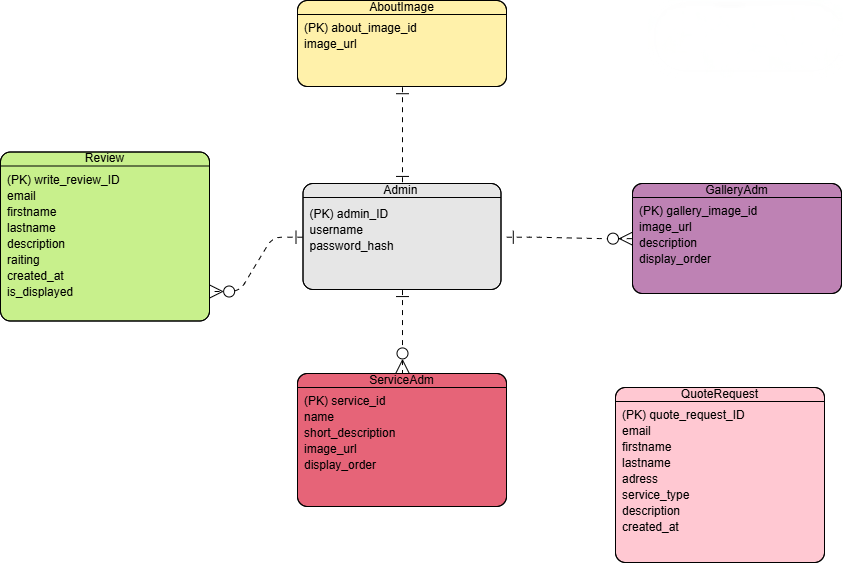

<h1 align="center">JM-Comfort</h1>

  

  This also serves as our projects logo.

## Table of Contents
- [Collaborators](#-collaborators)
- [Synopsis](#-synopsis)
- [Visuals](#-visuals)
- [Testing](#-testing)
- [Development](#-development)
- [Developer Instructions](#-developer-instructions)
- [Academic Information](#-academic-information)
- [Product Owner](#-project-product-owner)

## 📝 Synopsis 

JM Comfort is a full-stack HVAC service management platform designed to streamline the experience for both customers and mechanics. Our system focuses on allowing customers to schedule appointments, view services, read promotions, and interact with mechanics, while giving the business side tools for performance analytics, salary calculations, and status tracking.

**Core goals:**

- Build a clean, modern, mobile-friendly interface for customers

- Provide an intuitive dashboard for mechanics and staff

- Implement an appointment scheduling system with confirmations & notifications

- Track services, promotions, reviews, and status updates

- Support analytics features such as performance metrics and salary calculations

**Why:** Our goal is to provide a website where users can easily learn about JM‑Comfort and the services the company offers. When visitors feel the company is the right fit, they can quickly get in touch to request a quote or schedule an appointment.

## 🧪 Testing

  
<strong>To be completed in CSC 191</strong>

   

  **Expected deliverables may include:**
  - Unit tests for backend services
  - Integration tests for API routes
  - Automated frontend tests for components
  - Manual workflow testing (with logs + screenshots)

## 🚀 Deployment

  
<strong>To be completed in CSC 191</strong>

   

  **Deployment targets may include:**
  - Frontend: React / Tailwind / Vite
  - Backend: Node.js
  - Database: AWS RDS (MySQL)
  - Environment: CI/CD via GitHub Actions

## 📃 Developer Instructions

  
<strong>To be completed in CSC 191</strong>

   

  **This section will include:**
  - How to run the frontend & backend locally
  - API route documentation
  - Database setup instructions
  - Environment variable configuration
  - How to add new features or components

## 🖼️ Visuals 

### Screen Shots and Demos
Our goal is to have more finalized versions of most of the website pages by the end of the first sprint in CSC 191.

### Home page 

### Services page 

### Gallery page 

### Reviews page 
 

### About page 

### Contact page 
 

### Request-a-Quote Form 
 

### Login page

### Admin Dashboard 

### Admin Panel

### ERD diagram 

**Summary of ERD**: The only login required is for the admin, who can dynamically manage the website by updating gallery images, managing reviews, changing or updating service cards and their details, and updating time slots for the contact page. Besides managing the frontend, the admin dashboard also provides the user the ability to manage incoming requests and followup on any of the forms submitted through the website, as information submitted through said forms can be seen from the admins point of view. 

## 🏫 Academic Information 
**Sacramento State - CSC 190/191 Senior Project**  

**Course:** Senior Project Parts 1 and 2

**Semester:** Fall 2025 - Spring 2026  

**Instructor:** Kenneth Elliot  

**190 Lab Advisor:** Peng Kang  

**191 Lab Advisor:** Maryam Siddique

## 🤝 Collaborators:
- Ibrahim Aljanabi
- Cole Hollandsworth
- Kevin Maldonado
- Moneeb Najibi
- Fares Shobaki
- Jan Nassri
- Faizan Tariq
- Ammar Taeha

## 🤵 Project Product Owner
**Name:** Jose Maldanado     
**Title:** Owner   
**Organization:** JM Comfort     
**Email:** Jc11maldonado@gmail.com  

