<h1 align="center">JM-Comfort</h1>

<p align="center">
  
</p>

<p align="center">
  This also serves as our projects logo.
</p>

## Table of Contents
- [Synopsis](#-synopsis)
- [Technologies](#-technologies)
- [Visuals](#-visuals)
- [Testing](#-testing)
- [Deployment](#-deployment)
- [Developer Instructions](#-developer-instructions)
- [Academic Information](#-academic-information)
- [Collaborators](#-collaborators)
- [Product Owner](#-product-owner)


## 📝 Synopsis 

JM Comfort is a full-stack HVAC service management platform designed to streamline the experience for both customers and admin. Our system focuses on allowing users to request quotes, schedule appointments, view services, leave reviews, and learn more about the company.  

**Core goals:**

- Build a clean, modern, mobile-friendly interface for customers

- Provide an intuitive dashboard for the admin

- Implement an appointment scheduling system with confirmations & notifications

- Support analytics feature of requests that come in

- Provide the admin the ability to dynamically update the site in real time. 

**Why:** Our goal is to provide a website where users can easily learn about JM‑Comfort and the services the company offers. When visitors feel the company is the right fit, they can quickly get in touch to request a quote or schedule an appointment.

## 🖥️ Technologies 

### Frontend

- Next.js 14 (App Router) + React 19
- Tailwind CSS for utility‑first styling
-  React Router v7 
- Sentry for error monitoring
- Hosted on Vercel with CI/CD on push to main

### Backend

- Node.js 20 + Express 5 REST API
- API Routes (serverless functions in Next.js architecture)
- Authentication: bcrypt + JWT
- Email: Nodemailer
- File Uploads: AWS S3 Buckets 

### Database

-  Amazon RDS MySQL
- mysql2 connection pool
- Core tables: appointments, services, projects, reviews, leads, gallery

### System Architecture


### Development Tools

-  VS Code (IDE)
-  Git & GitHub for feature branches + pull requests
- Vite (used in the React SPA architecture)
- Jira for sprint planning, user stories, subtasks, backlog management


## 🧪 Testing

The project uses a two-layer testing strategy: **Jest** for backend unit/integration tests and **Playwright** for automated frontend testing.

**Backend (Jest)** — `server/` directory  
- 13 Jest tests covering gallery upload, validation, metadata, and error handling  
- Run with: `cd server && npm test`

**Frontend (Playwright)** — `scripts/` directory  
- 83 test cases across 21 test categories (home, services, gallery, admin, etc.)  
- Run with: `npm test` from the root

**Final test results:**

| Result | Count |
|--------|-------|
| PASS | 38 |
| FAIL | 5 |
| BLOCKED (requires backend) | 38 |
| NOT TESTED | 2 |
| **Pass rate (testable cases)** | **88.4%** |

### Known open defects

| ID | Severity | Description |
|----|----------|-------------|
| DEF-001 | High | Service detail route (`/services/:id`) missing — "Learn More" redirects to admin login |
| DEF-002 | High | Contact page shows placeholder instead of the contact form |
| DEF-003 | Low | Confirmation page renders duplicate footer |
| DEF-004 | Low | Unknown public URLs redirect to admin login instead of a 404 page |

<br><br>
## 🚀 Deployment

| Layer | Technology | Notes |
|-------|------------|-------|
| Frontend | React 19 / Vite / Tailwind CSS | Deployed as static assets |
| Backend | Node.js / Express 5 | Managed by PM2 (`ecosystem.config.js`) |
| Database | MySQL on AWS RDS | Schema in `DB/schema.sql`, migrations in `DB/migrations/` |
| File Storage | AWS S3 | Gallery image uploads via `server/config/s3.js` |
| Error Monitoring | Sentry | Configured via `SENTRY_DSN` env var |

**Environment variables** — copy `.env.example` to `.env` and fill in the values provided by the Admin (DB credentials, AWS keys, SMTP settings).


## 📃 Developer Instructions

### Prerequisites
- Node.js v22+
- MySQL (or access to the AWS RDS instance)
- AWS credentials (for gallery uploads)

### 1. Clone and install

```bash
git clone https://github.com/IbrahimAlj/JM-Comfort.git
cd JM-Comfort

# Install root dependencies
npm install

# Install backend dependencies
cd server && npm install && cd ..

# Install frontend dependencies
cd client && npm install && cd ..
```

### 2. Configure environment

```bash
cp .env.example .env
# Fill in DB_HOST, DB_PASS, AWS keys, and SMTP values — get credentials from Admin
```

### 3. Run database migrations

```bash
cd server && npm run migrate
```

### 4. Start the development servers

```bash
# Backend (runs on http://localhost:5000)
cd server && npm run dev

# Frontend — in a separate terminal (runs on http://localhost:5173)
cd client && npm run dev
```

### 5. Run tests

```bash
# Backend Jest tests
cd server && npm test

# Full test suite (backend + frontend)
npm test
```

### Key directories

| Path | Purpose |
|------|---------|
| `client/src/pages/` | Public-facing pages |
| `client/src/admin/` | Admin dashboard and upload UI |
| `server/routes/` | Express API route handlers |
| `server/services/` | Business logic layer |
| `server/__tests__/` | Jest unit/integration tests |
| `DB/migrations/` | SQL migration files |
| `docs/` | Architecture docs and test reports |

## 🖼️ Visuals 

### Screen Shots and Demos
Our goal is to have more finalized versions of most of the website pages by the end of the first sprint in CSC 191.

### Home page 
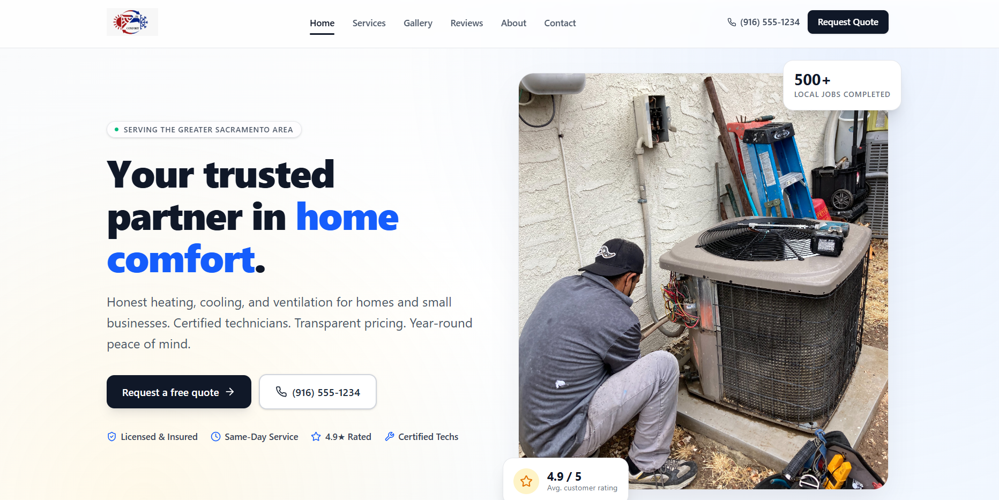

### Services page 
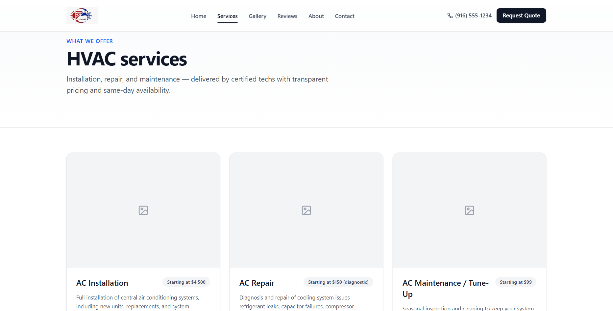

### Gallery page 
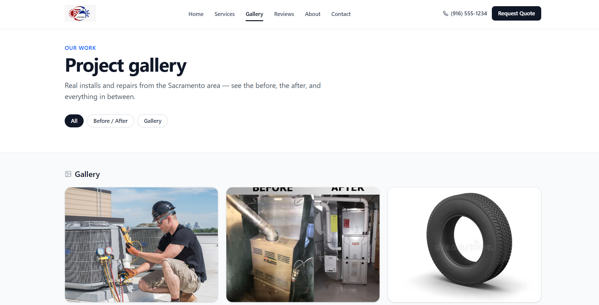

### Reviews page 
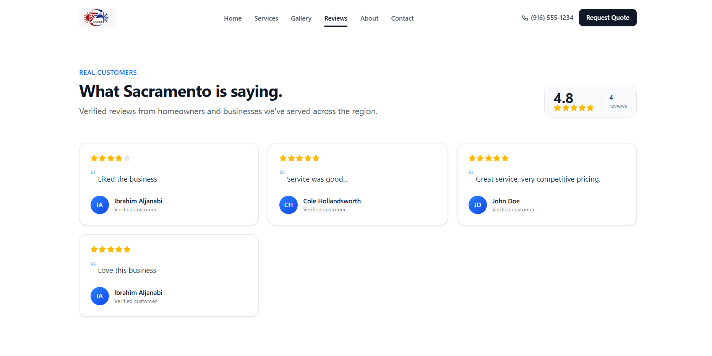 

### About page 
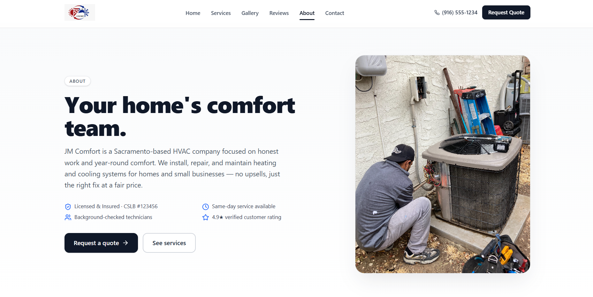

### Contact page 
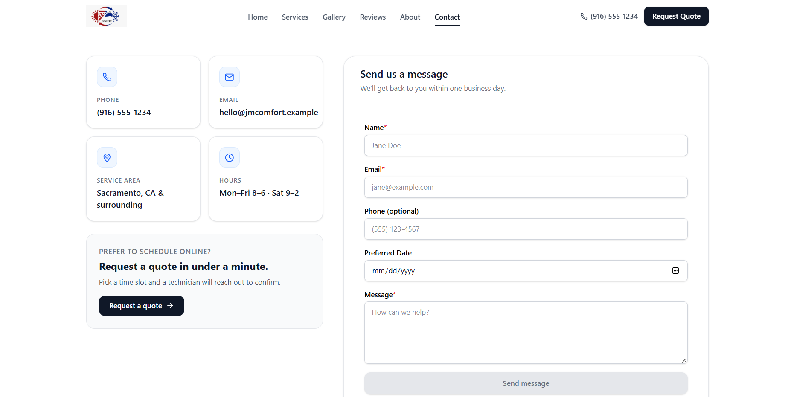 

### Request-a-Quote Form 
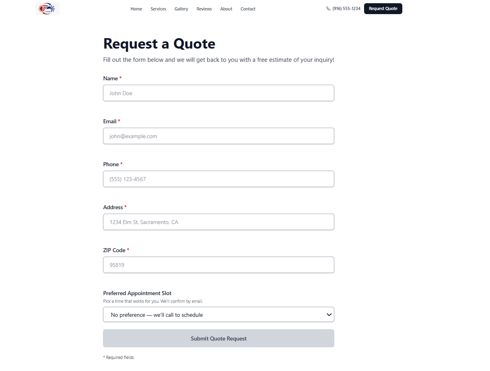 

### Login page
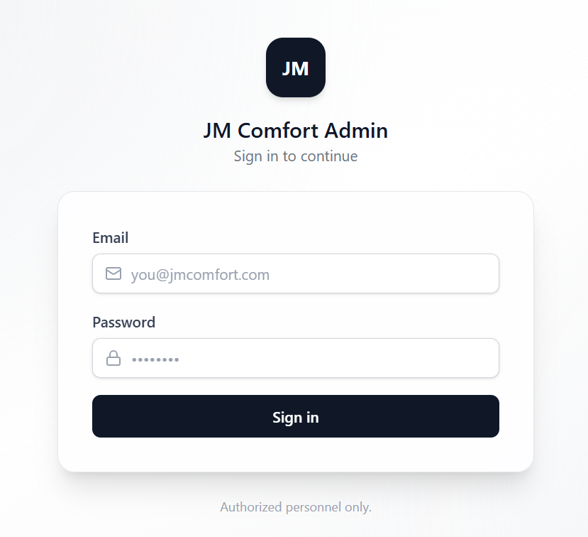

### Admin Dashboard 
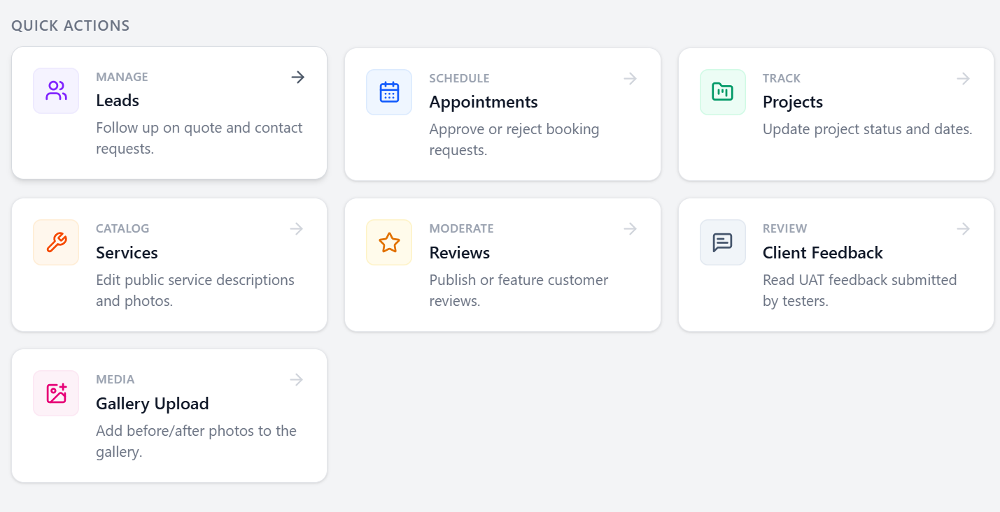

### Admin Panel
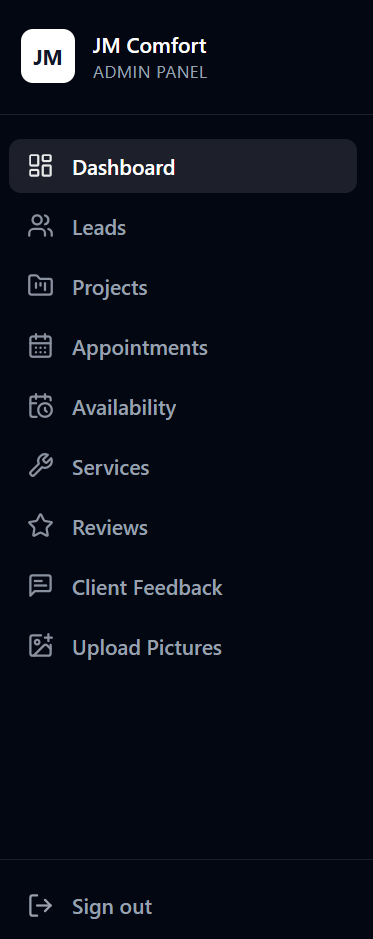

### ERD diagram 
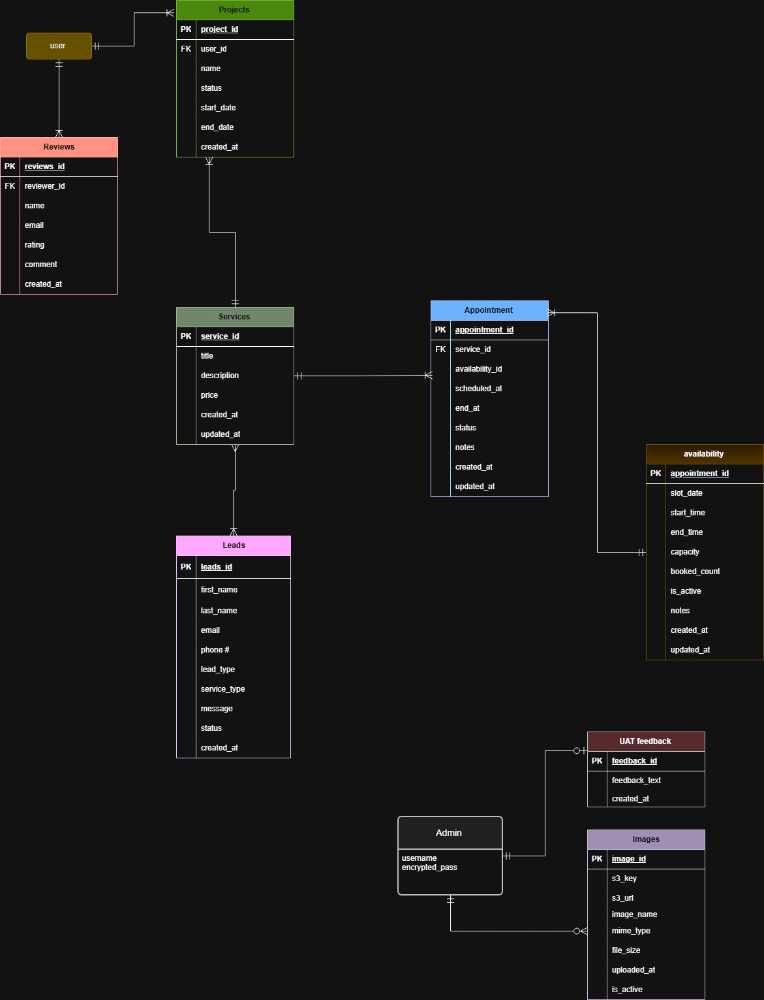

**Summary of ERD**: The only login required is for the admin, who can dynamically manage the website by updating gallery images, managing reviews, changing or updating service cards and their details, and updating time slots for the contact page. Besides managing the frontend, the admin dashboard also provides the user the ability to manage incoming requests and followup on any of the forms submitted through the website, as information submitted through said forms can be seen from the admins point of view. 

## 🏫 Academic Information 
**Sacramento State - CSC 190/191 Senior Project**  

**Course:** Senior Project Parts 1 and 2

**Semester:** Fall 2025 - Spring 2026  

**Instructor:** Kenneth Elliot  

**190 Lab Advisor:** Peng Kang  

**191 Lab Advisor:** Maryam Siddique

## 🤝 Collaborators:
- Ibrahim Aljanabi
- Cole Hollandsworth
- Kevin Maldonado
- Moneeb Najibi
- Fares Shobaki
- Jan Nassri
- Faizan Tariq
- Ammar Taeha

## 🤵 Product Owner
**Name:** Jose Maldanado     
**Title:** Owner   
**Organization:** JM Comfort     
**Email:** Jc11maldonado@gmail.com  

